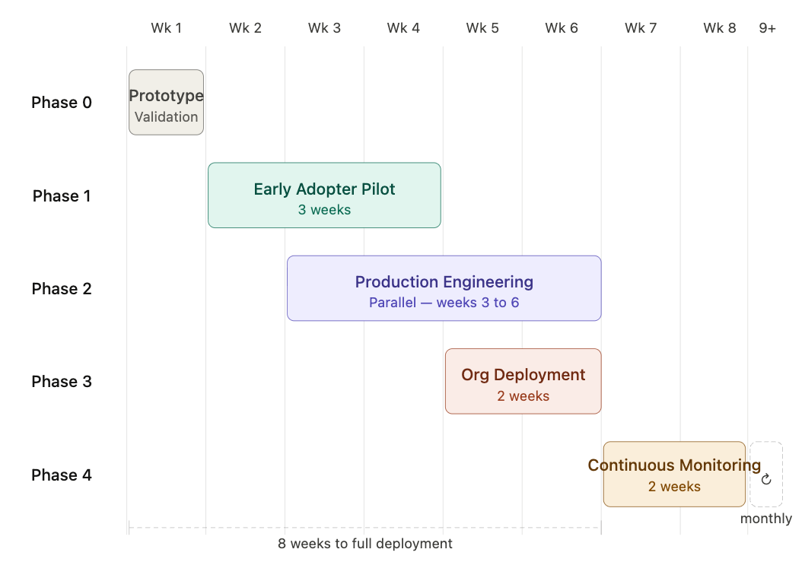

# Rollout Plan: Inbound Lead Enrichment Tool
## EliseAI — GTM Engineer Candidate Proposal

## Overview

This document outlines how I would approach testing and rolling out the inbound lead enrichment tool to EliseAI's sales organization. The goal is to move from a working prototype to a production-grade system that SDRs and Account Executives trust and use daily, without disrupting existing workflows during the transition.

The rollout follows five phases over 8 weeks. Phases 2 and 3 run in parallel: while SDRs are piloting the prototype, engineering work begins on making the system production ready. This ensures that by the time the tool reaches the entire sales organization, it is running on proper infrastructure rather than a cloned repository on someone's laptop.

## Timeline Summary

| Phase | Name | Start Week | End Week | Duration |
|---|---|---|---|---|
| 0 | Prototype Validation | 1 | 1 | 1 week |
| 1 | Early Adopter Pilot | 2 | 4 | 3 weeks |
| 2 | Production Engineering | 3 | 6 | Starts mid-Phase 1, runs through end of Phase 3 |
| 3 | Organization-Wide Deployment | 5 | 6 | 2 weeks |
| 4 | Continuous Monitoring and Refinement | 7 | 8, then ongoing | 2 weeks structured, then monthly |

**Total: 8 weeks to full deployment on production infrastructure, with a live refinement cadence.**

## Phase 0: Prototype Validation (1 week)

**Goal:** Confirm the tool works reliably end to end before any SDR touches it.

**What happens:**

Run the tool against at least 100 historical leads that already have known outcomes: leads that converted, leads that went cold, and leads that were disqualified. Scoring at this scale matters because patterns that look reasonable on 20 leads can break down quickly when the input is more varied. The goal is to surface enrichment failures, edge cases, and output formatting issues at a volume that actually stresses the pipeline.

Fix all critical failures before moving to Phase 1. Any lead where more than 3 of 6 data sources return no data is treated as a pipeline failure, not a bad lead, and must be debugged and resolved before the pilot begins. Output format is finalized in this phase so SDRs receive a consistent, clean file from day one of the pilot.

**Stakeholders involved:**
- GTM Engineer: building, running, and debugging the pipeline
- Sales Leadership (1 person): reviewing scored historical leads for directional accuracy
- Revenue Operations: confirming output format is compatible with CRM fields

**Done when:** Tool runs without errors on 100 historical leads, scores correlate reasonably with known outcomes, all critical enrichment failures are resolved, and output is clean enough for a non-technical SDR to read without guidance.

## Phase 1: Early Adopter Pilot (3 weeks)

**Goal:** Get the tool into the hands of real users as fast as possible and collect the signal needed to improve it.

**What happens:**

Select at least 5 SDRs to participate in the pilot. Three weeks is enough time to see real conversion signal start to emerge, not just anecdotal feedback. The pilot runs in parallel with existing workflows: SDRs receive the enriched output alongside their normal lead queue and continue working as usual. They are not asked to change how they work yet, only to use the output and flag anything that feels wrong.

At this stage the tool is still a prototype running locally. Each pilot SDR receives output by having the GTM Engineer run the pipeline manually or via a shared script. The `--schedule HH:MM` flag (e.g. `python main.py --schedule 09:00`) enables unattended daily runs on any shared machine with the tool installed, making manual intervention optional even during the pilot without requiring cloud infrastructure. This is intentional: it keeps the pilot lightweight and lets us iterate on scoring logic quickly without infrastructure constraints.

Collect structured feedback weekly on: which enriched signals they actually use, which they ignore, whether the draft outreach emails save meaningful time, and what data is missing or inaccurate. Track time saved per lead, SDR-reported score accuracy, and any data quality issues flagged.

At the end of week 2 of the pilot, run a mid-point review with the SDR manager. Use early conversion data and SDR feedback to make at least one scoring model adjustment before week 3. This makes clear to the team that the model responds to their input and builds trust before the organization-wide deployment.

**Stakeholders involved:**
- At least 5 SDRs: daily users and primary feedback source
- SDR Manager: framing the pilot, running weekly feedback sessions, mid-point review
- GTM Engineer: monitoring outputs, fixing issues in real time, shipping scoring model v1.1 after week 2
- Sales Leadership: receiving weekly summary of pilot results

**Done when:** SDRs report the tool saves meaningful time per lead, scoring feels directionally accurate to the majority of the pilot cohort, no critical data quality issues remain open, and scoring model v1.1 is live.

## Phase 2: Production Engineering (starts mid-Phase 1, runs through end of Phase 3)

**Goal:** Transform the prototype into a production-grade system while the pilot is running, so the organization-wide deployment does not depend on anyone's local machine.

**What happens:**

The current prototype is a Python script running on a cloned repository on the GTM Engineer's device. That is acceptable for a pilot with 5 SDRs but not for an entire sales organization. Phase 2 addresses everything required to make this system reliable, observable, and maintainable at scale.

**Infrastructure:**

Move the pipeline off local devices and onto a hosted environment. The tool needs a server or managed runtime that runs the enrichment pipeline on a trigger or schedule without manual intervention. Options include a lightweight cloud function (AWS Lambda or Google Cloud Run), a simple hosted Python service, or a workflow automation layer via Zapier or Make if code-free operation is preferred by the operations team. The right choice is confirmed with Revenue Operations and Engineering during week 2 of the pilot.

**Database:**

Replace the current CSV-based input and output with a proper data store. Enriched lead records, scores, score breakdowns, and draft emails are written to a database so they are queryable, auditable, and accessible across the team without file sharing. PostgreSQL is the default choice. Schema is designed in coordination with Revenue Operations to align with CRM data models.

**Authentication and Access Control:**

The tool currently has no authentication layer. In production, API keys must be stored in a secrets manager (AWS Secrets Manager or equivalent), not in a local environment file. Access to the enriched lead database is restricted by role. SDRs can read their own enriched leads. Managers can see all leads. Only the GTM Engineer can modify scoring weights or pipeline configuration.

**Monitoring Layer:**

Instrument the pipeline with basic observability: log every API call, its response status, and how long it took. Alert on enrichment failure rates above a defined threshold. Track which APIs are approaching free tier rate limits. This does not need to be complex in version 1: a simple logging setup with email or Slack alerts on failures is enough to start.

**CRM Integration:**

Define and implement the integration between the enrichment pipeline and EliseAI's CRM (Salesforce or HubSpot). Work with Revenue Operations to map enriched fields to existing CRM properties. The integration pushes the lead score, score breakdown, and draft email into the CRM record automatically so SDRs work from a single surface. This is the highest-effort item in Phase 2 and should be scoped with Revenue Operations in week 2 of the pilot to avoid blocking Phase 3.

**Stakeholders involved:**
- GTM Engineer: infrastructure, database, monitoring, and integration implementation
- Revenue Operations: CRM field mapping, integration requirements, database schema alignment
- Engineering (if available): infrastructure review and cloud environment setup
- Sales Leadership: sign-off on access control and data visibility rules

**Done when:** Pipeline runs on hosted infrastructure without local dependencies, all API keys are stored in a secrets manager, enriched data is written to a database, basic monitoring and alerting is live, and CRM integration is tested and ready to activate at Phase 3 launch.

## Phase 3: Organization-Wide Deployment (2 weeks, runs in parallel with Phase 2)

**Goal:** Make the tool the default workflow for all inbound leads, backed by production infrastructure.

**What happens:**

Based on pilot feedback, finalize scoring weights, output format, and email templates before the organization-wide launch. Run an onboarding session with the entire SDR and Account Executive team covering: what the tool does, what each output field means, how to read the score tiers, and how to use the draft email as a starting point rather than a finished product.

Activate the CRM integration built in Phase 2. From this point, enriched data flows directly into CRM records and SDRs work from a single surface. Establish the ongoing feedback channel: a dedicated Slack thread or lightweight form where SDRs can flag bad scores or missing data. This channel is reviewed weekly for the first month.

**Stakeholders involved:**
- Entire SDR and Account Executive team: end users
- SDR Manager and Sales Leadership: change management and adoption
- Revenue Operations: CRM integration activation and data pipeline monitoring
- GTM Engineer: monitoring, maintenance, and iteration

**Done when:** Tool is running automatically on all inbound leads on production infrastructure, CRM is receiving enriched data, and SDRs are actively using draft emails as a starting point in their outreach.

## Phase 4: Continuous Monitoring and Refinement (2 weeks structured, then ongoing monthly)

**Goal:** Treat the tool as a dynamic system that learns and improves, not a static deliverable.

**What happens:**

The scoring model shipped in Phase 0 is a version 1 hypothesis built on assumptions about what makes a good EliseAI lead. Phase 4 replaces those assumptions with real conversion data on a regular cadence.

**Week 7:** Pull the first batch of conversion data from the CRM and compare scored leads against actual outcomes. Measure whether high-scored leads are converting at a higher rate than medium and low-scored leads. Identify which signals are the strongest predictors of conversion and which weights need adjustment. Document findings and ship scoring model v2.

**Week 8:** Review API coverage across all leads processed since deployment. Measure how often enrichment calls are failing or returning empty data, and check whether free tier rate limits are being hit consistently. Identify which APIs are underperforming and flag paid tier upgrades or replacements for Sales Leadership to make a budget decision on.

**Monthly cadence from week 9 onward:**

- **Scoring model evolution:** As conversion data accumulates, evaluate whether a machine learning model trained on actual outcomes would outperform the current manually weighted scoring system. Even a simple logistic regression or gradient boosting model trained on enriched lead features and conversion labels can surface non-obvious predictors and remove the bias of hand-tuned weights. Plan a formal evaluation at the 3-month mark once enough labeled conversion data exists.

- **Analytics and attribution:** Deploy analytics tooling to measure which enrichment signals actually predict conversion, not just which ones feel relevant. Tools like Mixpanel, Amplitude, or a simple BI layer over the PostgreSQL database can surface feature importance, score distribution by cohort, and conversion rate by tier. This replaces subjective SDR feedback with quantitative signal on what is driving results.

- **AI system monitoring:** The tool uses AI-generated outreach emails and potentially AI-assisted scoring. Monitor prompt performance over time: track which prompt versions produce emails that SDRs actually send unmodified vs. heavily edited, measure response rates on AI-drafted outreach vs. manually written emails, and version all prompts so changes are traceable. Monitor the underlying models used and any API changes from providers that could affect output quality or cost. This is not optional: AI components drift silently without this layer.

- **Data source quality and cost monitoring:** Rank all enrichment sources by signal quality, coverage rate, and cost per lead. Sources that return empty data frequently or whose signals show low correlation with conversion should be deprioritized or replaced. Track API costs monthly across all paid tiers and flag when cost per enriched lead exceeds a defined threshold. Evaluate new data sources on a quarterly basis against this quality and cost framework before adding them to the pipeline.

- **Integration refinement:** As the CRM integration matures, identify gaps between what the tool produces and what SDRs actually need in their workflow. Refine field mappings, add new output fields based on SDR feedback, and evaluate whether additional integrations (Slack notifications for high-scored leads, Outreach or Salesloft sequencing triggers) would reduce manual steps further.

- **ICP evolution:** Monitor EliseAI's ICP as the company expands into healthcare. New scoring signals will become relevant (clinic size, patient volume, EHR software stack). A healthcare-specific scoring model should be scoped once healthcare lead volume becomes material.

- **SDR adoption and feedback:** Review SDR feedback from the shared channel monthly. Track adoption rate. If usage drops, investigate before assuming the tool is working correctly.

**Stakeholders involved:**
- GTM Engineer: model iteration, API monitoring, prompt versioning, feature additions, cost tracking
- Revenue Operations: CRM conversion data, reporting, integration refinements
- SDR Manager: monthly feedback review and adoption tracking
- Sales Leadership: ICP alignment, budget decisions on paid API upgrades, ML model evaluation sign-off
- Data or Analytics team (if available): BI tooling, feature importance analysis, ML model training

**Done when:** Monthly refinement cadence is established, scoring model v2 is live, AI monitoring and prompt versioning are active, data source quality rankings are documented, and at least one measurable lift in lead conversion rate vs. the pre-tool baseline is documented and shared with Sales Leadership.

## Success Metrics

| Metric | Target |
|---|---|
| Time saved per lead (research and email draft) | 15 or more minutes per lead |
| SDR adoption rate at end of Phase 3 | 80% or more of SDRs using tool daily |
| Score accuracy (high scores converting at higher rate) | Measurable lift vs. unscored baseline |
| Enrichment success rate (at least 4 of 6 data sources returning data) | 90% or more of leads |
| SDR satisfaction with draft outreach emails | Positive feedback from majority of pilot cohort |
| Pipeline uptime on production infrastructure | 99% or more |
| Scoring model iteration cadence | At least one weight revision per month based on conversion data |

## Key Risks and Mitigations

**API rate limits on free tiers:** Serper (2,500 searches on free tier) and PDL (100 per month) will hit limits quickly at scale. Mitigation: implement caching so the same company domain or email is never queried twice, and flag paid tier upgrades as an immediate post-Phase 3 investment decision.

**SDR trust in AI-generated emails:** SDRs may be skeptical of using AI-drafted outreach. Mitigation: frame the email as a first draft that always requires personalization, not a send-ready message. Use before and after examples from the pilot in the organization-wide onboarding session.

**Scoring model accuracy:** The version 1 model is built on assumptions, not historical conversion data. Mitigation: be transparent about this from day one, treat it as a hypothesis to test, and schedule an explicit scoring revision at the mid-point review in Phase 1 using pilot conversion data.

**CRM integration complexity:** Pushing enriched data into Salesforce or HubSpot may require Revenue Operations involvement and take longer than expected. Mitigation: scope the integration in week 2 of the pilot, treat it as a Phase 2 deliverable running in parallel with Phase 3, and start with read-only CRM access to validate field mapping before writing data.

**Infrastructure setup delays:** Cloud environment setup may require coordination with Engineering or IT. Mitigation: start Phase 2 scoping conversations in week 2 of the pilot, not at the end of it. Identify the hosting environment early so there are no surprises blocking Phase 3 launch.

**ICP drift:** EliseAI is expanding into healthcare. The current scoring model is built entirely for housing and property management. Mitigation: flag this explicitly in Phase 4 and schedule an ICP alignment session with Sales Leadership when healthcare lead volume becomes material.

## Production Upgrade Path

Once the tool is live and generating signal, the natural next investments are:

- Replace free API tiers with paid providers (Clearbit or ZoomInfo for company data, Bombora for intent signals)
- Build a feedback loop that uses actual CRM conversion data to retrain scoring weights automatically
- Expand from inbound to outbound: proactively score accounts in EliseAI's total addressable market before they submit a lead
- Integrate with Clay for waterfall enrichment orchestration, replacing the manual API stack
- Build a healthcare-specific scoring model as that vertical grows
